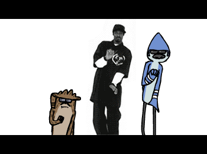

# Markov The Rapper

What you'll need:

  - JFugue - Midi Loader
  - FreeTTS - Text to speech
  - Jsoup - Website parsing

This program will play the selected Midi file in the background on one thread while reading the markov chain generated text via FreeTTS (default is set to Kevin16) or any website of your choosing. Pass in lyrics from your favorite song and a trap 808 beat to have some fun. 

### Links
Links to Jars and resources

* [FreeTTS](http://freetts.sourceforge.net/docs/index.php)
* [JFugue](http://www.jfugue.org/)
* [Jsoup](http://jsoup.org/)

